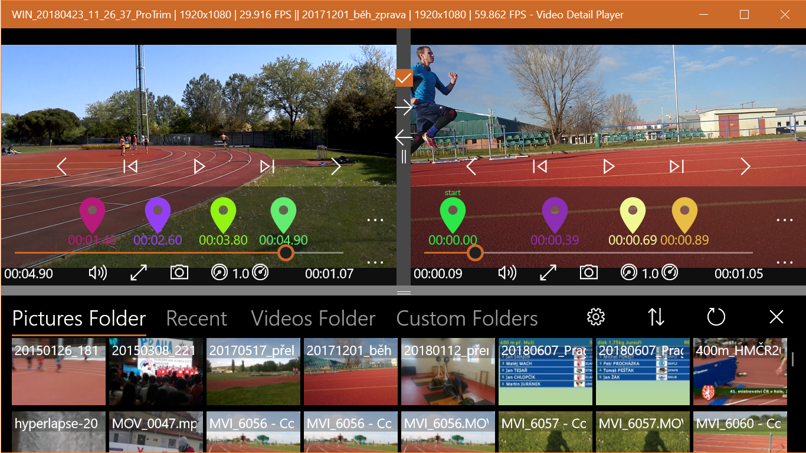

Title: Video Detail Player
ShowInNavbar: true
image: video-detail-player/media/video_detail_player_image.png
---

# Video Detail Player

Video player for Windows 10 with features for detail analysis of movement.

[Available here](https://www.microsoft.com/en-us/p/video-detail-player/9p34ghb2h88r)

## Features

- Free app, no adds. Really!
- Play video in slow motion or frame by frame
- Take pictures from video 
- Zoom important details 
- Analyze intervals with markers mode 
- Play videos side by side 
- Trims videos to new files in original resolution (from marker menu)"
- Controlled by touch, keyboard or mouse
- Navigate through video with markers
- Stores position in playback 
- Shows playback history 

## Feedback is welcome

<form action="https://formspree.io/form_x_25082@tesar.tech" method="POST">
    <fieldset>
    <legend>If you have any idea, comment or wish related to the app, use this form</legend>
    Email for answer (optional): 
    <input type="email" name="mail" > 
    Message: 
    <textarea  rows="4" cols="50" name="message" > </textarea>   
    <input type="submit" value="Send">
  </fieldset>
</form>

## Known bugs

- There is some issue with .m2ts filename extension.

## Old bugs

- Translation in Markers report is missing (From/To).
- You can send empty feedback messages.
- Shortcut for toggling Markes mode is same as for placing Marker (M).
- Doesn't respect changed speed after restarting app
- No file size in video info