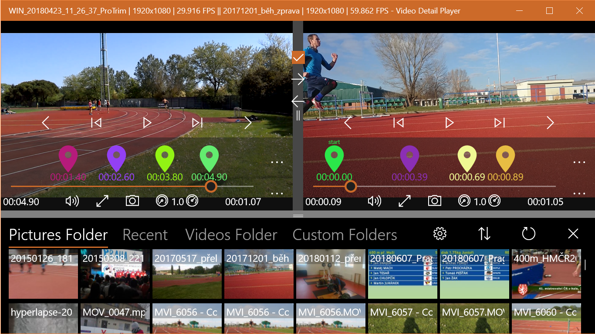

Title: Video Detail Player
ShowInNavbar: false
image: media/video_detail_player_image.png
---

# Video Detail Player

[English version](index_en)

Přehrávač videa s funkcemi pro detailní analýzu pohybu. Pro Windows 10. Zdarma.

[Dostupné zde](https://www.microsoft.com/cs-cz/p/video-detail-player/9p34ghb2h88r)

## Hlavní funkce

- Appka je zadarmo a bez reklam. Fakt!
- Přehrává video zpomaleně i snímek po snímku
- Dokáže snímat fotky z videa
- Umožňuje zoomovat video
- Disponuje módem značek pro analýzu intervalů
- Zvládne přehrávat více videí najednou
- Ovládá se dotykem, klávesnicí nebo myší
- Rychlá navigace ve videu pomocí značek
- Pamatuje si poslední pozici
- Zobrazuje historii přehrávaných videí
- A mnohem víc...

## Zpětná vazba - vítána

<form action="https://formspree.io/form_x_25082@tesar.tech" method="POST">
    <fieldset>
    <legend>Máte-li nějaký podmět, komentář, či přání týkající se aplikace, využijte tento formulář</legend>
    Email pro odpověď (volitelné): 
    <input type="email" name="mail" > 
    Zpráva: 
    <textarea  rows="4" cols="50" name="message" > </textarea>   
    <input type="submit" value="Odeslat">
  </fieldset>
</form>
